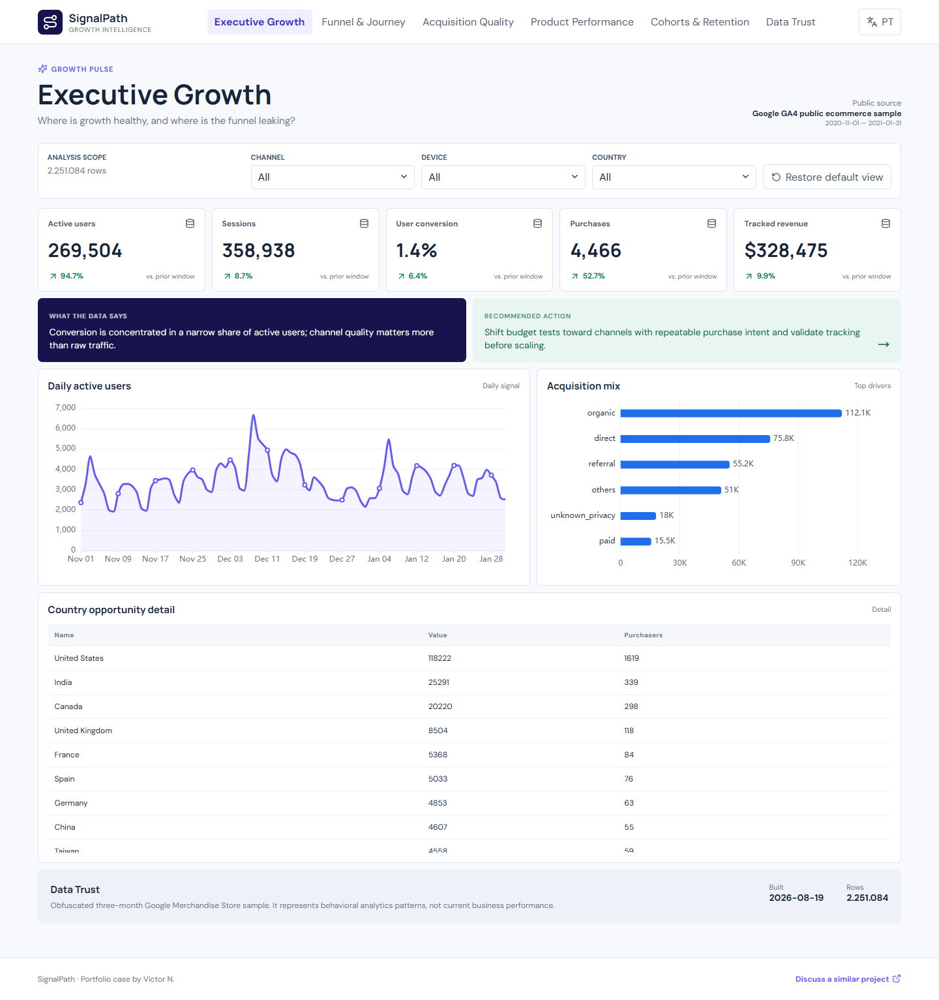

# SignalPath Growth Intelligence

A bilingual product analytics case that turns public GA4 event data into decisions about acquisition quality, funnel friction, product demand, and return behavior.



## Business problem

Growth teams often optimize sessions and clicks while losing sight of qualified behavior. SignalPath answers where users abandon purchase intent, which channels bring stronger journeys, and which product groups deserve experimentation.

## Data

- Official source: `bigquery-public-data.ga4_obfuscated_sample_ecommerce.events_*`.
- Public Google Merchandise Store sample, 1 Nov 2020 to 31 Jan 2021.
- Demo built from 2.25M event rows; only compact derived marts are published.
- The sample is obfuscated and may contain placeholders or internal inconsistencies.

## Decision experience

`Executive Growth` → `Funnel & Journey` → `Acquisition Quality` → `Product Performance` → `Cohorts & Retention` → `Data Trust`

Each page follows situation, explanation, opportunity, and action. KPIs and comparisons are computed by the pipeline rather than written into the interface.

## Architecture

`GA4 BigQuery → Python/DuckDB → dbt marts → Parquet/JSON → React + ECharts + TanStack Table`

The public app is static and can be hosted at zero fixed cost. The compact Parquet mart is compatible with DuckDB-WASM for client-side SQL exploration.

## Run locally

```powershell
python -m venv .venv
.venv\Scripts\pip install -r requirements.txt
npm install
python -m pipeline build --events D:\path\fact_events_cleaned.parquet --products D:\path\fact_product_cleaned.parquet
npm run dev
```

Validate with `python -m pipeline validate`, `pytest`, `npm test`, `npm run build`, and `npm run test:e2e`. Filters execute client-side SQL against the compact Parquet mart through DuckDB-WASM.

## Portfolio evidence

- Correct event, session, user, item, and transaction grains.
- Revenue counted from purchased items without multiplying event joins.
- Funnel and channel metrics with explicit definitions and limitations.
- Persistent English/Portuguese UI and responsive layouts.
- Source lineage and measurement caveats visible in the product.

## Client adaptation

The same model can connect to a company's GA4 export, backend orders, media costs, and experimentation data. [Discuss a similar project](mailto:comercial@wickoai.com.br).

See also [Portuguese documentation](README.pt-BR.md), [complete dashboard guide](docs/DASHBOARD_GUIDE.md), [metric catalog](docs/METRIC_CATALOG.md), and [demo guide](docs/DEMO_GUIDE.md).
