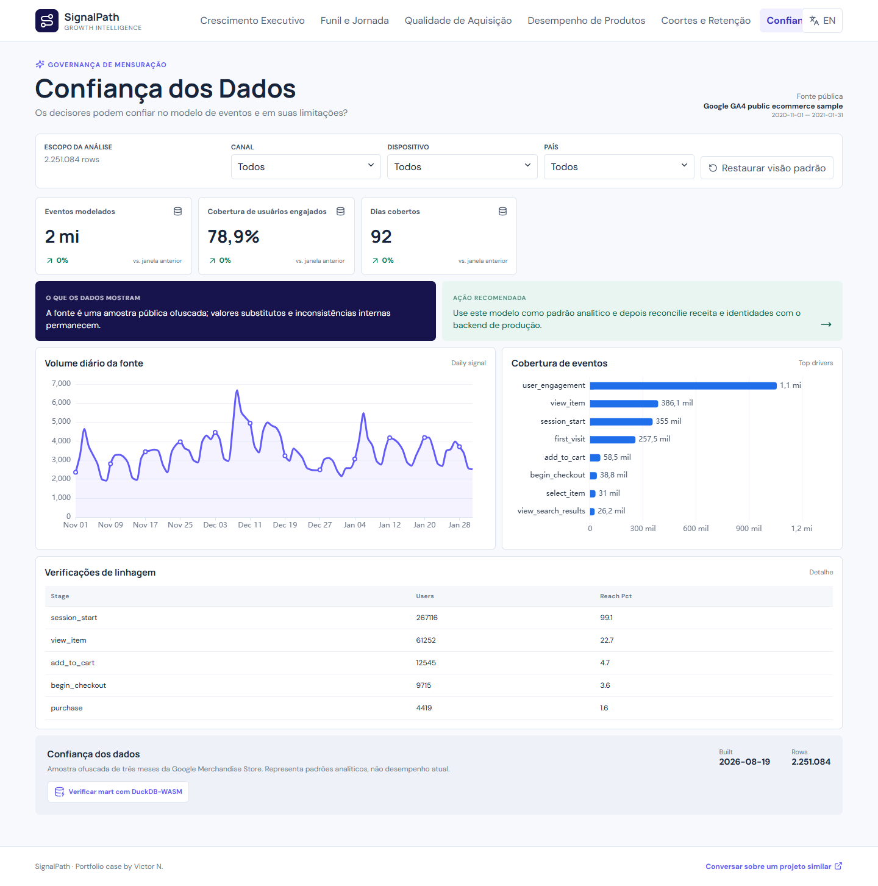

# SignalPath Growth Intelligence

## Documentação

- [Guia completo do dashboard](docs/DASHBOARD_GUIDE.pt-BR.md)
- [Catálogo de métricas](docs/METRIC_CATALOG.md)
- [Roteiro de demonstração](docs/DEMO_GUIDE.md)



Case bilíngue de Product Analytics que transforma eventos públicos do GA4 em decisões sobre aquisição, fricção do funil, produtos e retorno de usuários.

## Problema de negócio

Equipes de Growth frequentemente otimizam sessões e cliques sem distinguir tráfego de comportamento qualificado. O SignalPath mostra onde a intenção de compra se perde, quais canais geram jornadas melhores e quais grupos de produtos merecem experimentação.

## Dados e arquitetura

- Fonte oficial: amostra pública `ga4_obfuscated_sample_ecommerce` da Google Merchandise Store.
- Pipeline: `BigQuery → Python/DuckDB → dbt → Parquet/JSON → React/ECharts`.
- A demo foi construída com 2,25 milhões de eventos e publica somente marts compactos.
- Os dados são ofuscados, históricos e podem conter valores substitutos ou inconsistências.

## Execução

```powershell
python -m venv .venv
.venv\Scripts\pip install -r requirements.txt
npm install
python -m pipeline build --events D:\caminho\events.parquet --products D:\caminho\products.parquet
npm run dev
```

O case demonstra granularidade correta, reconciliação de compras, catálogo de métricas, interface responsiva em dois idiomas e limitações visíveis. Para adaptar a solução a GA4, pedidos, mídia e testes de uma empresa real: [contato](mailto:comercial@wickoai.com.br).
